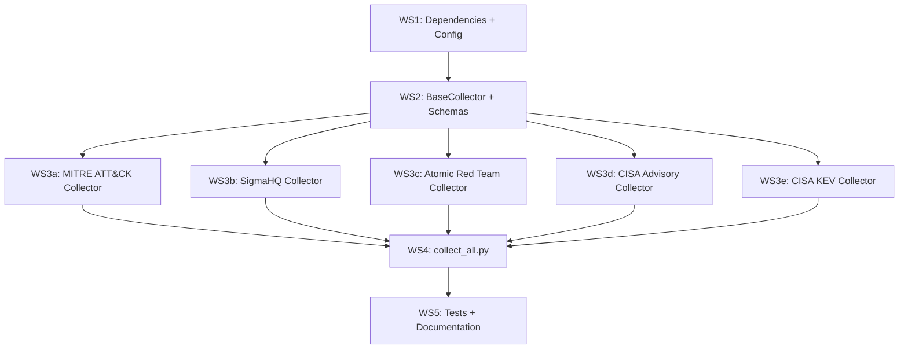

# Phase 2: Source Collection Pipeline — Implementation Plan

## Goal

Build five independent, re-runnable collectors that pull structured DFIR source data from MITRE ATT&CK, SigmaHQ, Atomic Red Team, CISA Advisories, and the CISA KEV Catalog into a standardized JSONL format under `data/raw/`. This is **Week 3 Day 4 – Week 5** per the master plan (~8 working days).

## Background

Phase 1 delivered:
- Project scaffolding (directory tree, `pyproject.toml`, configs)
- Taxonomy YAML (`taxonomy/dfir_taxonomy.yaml`) with 5 categories, 50 example tasks
- Validation scripts and tests

Phase 2 builds on this foundation by populating `collectors/` with working code that produces ~6,000+ raw documents.

---

## Resolved Decisions

> Resolved 2026-06-03.

1. **CISA collector strategy:** ✅ Two-pass RSS + BeautifulSoup HTML scrape approved. Fetch full advisory content, not just RSS summaries.
2. **CISA KEV catalog:** ✅ Added as a fifth collector. Single JSON download, grouped by vendor to produce documents with sufficient content for synthesis.
3. **Git clone caching:** ✅ `data/raw/.repos/` is the accepted location for shallow-cloned SigmaHQ and Atomic Red Team repos.
4. **MITRE ATT&CK scope:** ✅ Enterprise matrix only for Phase 2. ICS and Mobile matrices deferred to successor (noted in `dfir_dataset_plan.md §2.6 Collector Implementation Notes`).
5. **CISA rate limiting:** 1-second delay between requests (configured in `collection.yaml`).

---

## Proposed Changes

### Workstream 1 — Dependencies & Configuration

#### [MODIFY] [pyproject.toml](file:///home/hunta/dfir-dataset/pyproject.toml)

Add Phase 2 dependencies:

```toml
dependencies = [
    "pyyaml",
    "pydantic>=2.0",
    "jsonlines",
    "rich",
    # Phase 2 — Collection
    "mitreattack-python>=1.0",   # MITRE ATT&CK STIX API
    "requests>=2.31",            # HTTP for CISA + STIX download
    "beautifulsoup4>=4.12",      # CISA HTML parsing
    "lxml",                      # Fast HTML/XML parser backend
    "gitpython>=3.1",            # Git clone/pull for Sigma + ART
    "tqdm>=4.60",                # Progress bars for long collections
]
```

#### [MODIFY] [configs/collection.yaml](file:///home/hunta/dfir-dataset/configs/collection.yaml)

Expand with full configuration per source:

```yaml
sources:
  mitre_attack:
    type: "stix"
    stix_url: "https://raw.githubusercontent.com/mitre/cti/master/enterprise-attack/enterprise-attack.json"
    cache_path: "data/raw/.cache/enterprise-attack.json"
    output_dir: "data/raw/mitre_attack"
    include_deprecated: false
    include_revoked: false

  sigma_rules:
    type: "git"
    url: "https://github.com/SigmaHQ/sigma.git"
    clone_dir: "data/raw/.repos/sigma"
    rules_subdir: "rules"           # Only parse rules/ subtree
    output_dir: "data/raw/sigma_rules"
    shallow_clone: true
    min_rule_level: "low"           # Skip 'informational' rules

  atomic_red_team:
    type: "git"
    url: "https://github.com/redcanaryco/atomic-red-team.git"
    clone_dir: "data/raw/.repos/atomic-red-team"
    atomics_subdir: "atomics"
    output_dir: "data/raw/atomic_red_team"
    shallow_clone: true
    platforms: ["windows", "linux", "macos"]  # All platforms

  cisa_advisories:
    type: "rss_scrape"
    rss_url: "https://www.cisa.gov/cybersecurity-advisories/all.xml"
    output_dir: "data/raw/cisa_advisories"
    request_delay_seconds: 1.0
    max_advisories: null            # null = collect all available
    user_agent: "dfir-dataset-collector/0.1 (research)"

  cisa_kev:
    type: "json"
    json_url: "https://www.cisa.gov/sites/default/files/feeds/known_exploited_vulnerabilities.json"
    output_dir: "data/raw/cisa_kev"
    group_by: "vendorProject"       # Group entries by vendor for richer documents
    min_group_size: 1               # Include even single-entry vendors

settings:
  manifest_dir: "data/raw"
  log_level: "INFO"
```

#### [MODIFY] [.gitignore](file:///home/hunta/dfir-dataset/.gitignore)

Add entries for cached repos and STIX data:

```
data/raw/.repos/
data/raw/.cache/
```

---

### Workstream 2 — BaseCollector & Common Utilities

#### [NEW] [collectors/schemas.py](file:///home/hunta/dfir-dataset/collectors/schemas.py)

Pydantic models for the raw document schema (from `dfir_dataset_plan.md §2.4`):

```python
class RawDocument(BaseModel):
    """Standardized raw document output by all collectors."""
    doc_id: str                           # e.g. "mitre-attack-T1059.001"
    source: str                           # e.g. "mitre_attack"
    source_url: str
    title: str
    date_collected: str                   # ISO date
    date_published: str | None = None
    content_type: str                     # e.g. "technique_definition", "sigma_rule"
    content_markdown: str                 # Full content as markdown
    metadata: dict[str, Any]             # Source-specific metadata
    license: str
    word_count: int

class CollectionManifest(BaseModel):
    """Manifest written after each collection run."""
    collector: str
    version: str
    source_url: str
    license: str
    collected_at: str
    document_count: int
    errors: list[str] = []
    warnings: list[str] = []
    duration_seconds: float
```

#### [NEW] [collectors/base.py](file:///home/hunta/dfir-dataset/collectors/base.py)

Abstract base class with shared utilities:

```python
class BaseCollector(ABC):
    """Base class for all source collectors."""
    VERSION: str = "0.1.0"
    SOURCE_URL: str
    LICENSE: str

    @abstractmethod
    def collect(self, output_dir: Path) -> int:
        """Collect documents, write JSONL to output_dir. Returns doc count."""

    @abstractmethod
    def validate(self, output_dir: Path) -> dict:
        """Validate collected data. Returns validation report."""

    def manifest(self) -> dict: ...

    # Shared utilities:
    def _write_documents(self, docs: list[RawDocument], output_dir: Path) -> int:
        """Write validated documents to JSONL with progress bar."""

    def _count_words(self, text: str) -> int:
        """Consistent word counting across collectors."""

    def _to_markdown(self, text: str) -> str:
        """Normalize content to clean markdown."""
```

#### [MODIFY] [collectors/__init__.py](file:///home/hunta/dfir-dataset/collectors/__init__.py)

Export the collector classes for `collect_all.py`:

```python
from collectors.base import BaseCollector
from collectors.mitre_attack import MitreAttackCollector
from collectors.sigma_rules import SigmaRulesCollector
from collectors.atomic_red_team import AtomicRedTeamCollector
from collectors.cisa_advisories import CISAAdvisoryCollector
from collectors.cisa_kev import CISAKEVCollector
```

---

### Workstream 3 — Collector Implementations

#### [NEW] [collectors/mitre_attack.py](file:///home/hunta/dfir-dataset/collectors/mitre_attack.py)

**Strategy:** Download `enterprise-attack.json` from `mitre/cti` GitHub → load with `MitreAttackData` → iterate techniques → enrich with procedures, mitigations, data sources → emit one `RawDocument` per technique/sub-technique.

Key implementation details:

| Aspect | Approach |
|---|---|
| STIX download | `requests.get()` → cache to `data/raw/.cache/enterprise-attack.json` |
| Technique iteration | `mitre_attack_data.get_techniques()` → filter out deprecated/revoked |
| Sub-technique linking | `get_parent_technique_of_subtechnique()` to build hierarchy |
| Procedure extraction | `get_procedure_examples_by_technique(stix_id)` → format as markdown list |
| Tactic mapping | Extract from technique's `kill_chain_phases` |
| Detection guidance | Extract `x_mitre_detection` field from technique object |
| Data sources | Extract from technique's `x_mitre_data_sources` |
| `content_markdown` | Structured markdown combining description, procedures, detection, mitigations |
| `metadata` dict | `mitre_id`, `tactic[]`, `platforms[]`, `data_sources[]`, `detection`, `procedures[]`, `mitigations[]`, `is_subtechnique`, `parent_technique` |

**Expected yield:** ~750-800 documents

---

#### [NEW] [collectors/sigma_rules.py](file:///home/hunta/dfir-dataset/collectors/sigma_rules.py)

**Strategy:** Shallow-clone SigmaHQ repo → walk `rules/` directory → parse each `.yml` file with `yaml.safe_load` → emit one `RawDocument` per rule.

> [!NOTE]
> Using raw `yaml.safe_load` instead of `pySigma` to avoid the heavy dependency. We only need to extract metadata, not convert rules. The YAML structure is stable and well-documented.

Key implementation details:

| Aspect | Approach |
|---|---|
| Git clone | `git.Repo.clone_from(url, clone_dir, depth=1)` or `repo.remotes.origin.pull()` if exists |
| File discovery | `Path(rules_subdir).rglob("*.yml")` |
| Parsing | `yaml.safe_load()` per file |
| ATT&CK tag extraction | Parse `tags` field for `attack.tXXXX` patterns → normalize to `TXXXX` |
| Level filtering | Skip rules where `level` < configured `min_rule_level` |
| `content_markdown` | Full YAML rendered as fenced code block + structured metadata above it |
| `metadata` dict | `rule_id` (Sigma UUID), `title`, `logsource` (product/category/service), `level`, `status`, `attack_tags[]`, `author`, `falsepositives[]`, `references[]` |

**Expected yield:** ~3,000+ documents

---

#### [NEW] [collectors/atomic_red_team.py](file:///home/hunta/dfir-dataset/collectors/atomic_red_team.py)

**Strategy:** Shallow-clone ART repo → walk `atomics/` directory → parse each `T*.yaml` file → emit one `RawDocument` per individual atomic test (not per technique file).

Key implementation details:

| Aspect | Approach |
|---|---|
| Git clone | Same pattern as Sigma |
| File discovery | `Path(atomics_subdir).glob("T*/T*.yaml")` |
| Parsing | `yaml.safe_load()` → iterate `atomic_tests` list within each file |
| Doc ID | `art-{technique_id}-{test_index}` (e.g., `art-T1059.001-0`) |
| `content_markdown` | Test description + attack commands (fenced code) + cleanup commands + input args |
| `metadata` dict | `attack_technique`, `test_name`, `supported_platforms[]`, `executor_type`, `has_cleanup`, `input_arguments[]`, `dependencies[]` |

**Expected yield:** ~800+ documents (one per atomic test, not per technique file)

---

#### [NEW] [collectors/cisa_advisories.py](file:///home/hunta/dfir-dataset/collectors/cisa_advisories.py)

**Strategy:** Parse RSS feed for advisory URLs → fetch each advisory HTML page → extract structured content with BeautifulSoup → emit one `RawDocument` per advisory.

Key implementation details:

| Aspect | Approach |
|---|---|
| RSS parsing | `lxml.etree.parse()` on the RSS XML feed |
| HTML fetching | `requests.get()` with configurable delay between requests |
| Content extraction | BeautifulSoup with `lxml` backend → target main content div |
| CVE extraction | Regex `CVE-\d{4}-\d{4,7}` from body text |
| ATT&CK extraction | Regex `T\d{4}(\.\d{3})?` from body text |
| IOC extraction | Regex patterns for IPs, domains, hashes, file paths |
| `content_markdown` | Advisory title + summary + affected products + mitigations + IOCs |
| `metadata` dict | `advisory_id`, `cves[]`, `affected_products[]`, `iocs{}`, `mitre_techniques[]`, `severity` |
| Error handling | Skip individual pages that fail (log warning), continue with rest |

**Expected yield:** ~500+ documents

---

#### [NEW] [collectors/cisa_kev.py](file:///home/hunta/dfir-dataset/collectors/cisa_kev.py)

**Strategy:** Download the KEV JSON catalog (single file) → group entries by `vendorProject` → emit one `RawDocument` per vendor group. Grouping by vendor produces documents with enough content for meaningful synthesis, since individual KEV entries are thin (~50-100 words each).

Key implementation details:

| Aspect | Approach |
|---|---|
| JSON download | `requests.get()` → parse directly, no caching needed (small file, ~1MB) |
| Grouping | Group `vulnerabilities` array by `vendorProject` field |
| Doc ID | `kev-{vendor_slug}` (e.g., `kev-microsoft`, `kev-apache`) |
| `content_type` | `"kev_vendor_group"` |
| `content_markdown` | Vendor name + table of CVEs with product, description, dates, ransomware flag + remediation actions |
| `metadata` dict | `vendor`, `cve_count`, `cves[]`, `products[]`, `ransomware_use_count`, `date_range` (earliest/latest `dateAdded`) |
| License | Public domain ✅ (US government work) |

> [!NOTE]
> Individual KEV entries are also available as flat records if a future phase needs per-CVE granularity. The vendor-grouped approach is chosen for Phase 2 because it produces documents rich enough for triage and detection engineering synthesis pairs.

**Expected yield:** ~200-300 documents (vendor groups from ~1,200+ KEV entries)

---

### Workstream 4 — Orchestration & Entry Point

#### [NEW] [scripts/collect_all.py](file:///home/hunta/dfir-dataset/scripts/collect_all.py)

Entry point that runs all 5 collectors sequentially and produces a combined manifest:

```python
def main():
    """Run all collectors, write manifest, print summary."""
    config = load_config("configs/collection.yaml")
    collectors = [
        MitreAttackCollector(config["sources"]["mitre_attack"]),
        SigmaRulesCollector(config["sources"]["sigma_rules"]),
        AtomicRedTeamCollector(config["sources"]["atomic_red_team"]),
        CISAAdvisoryCollector(config["sources"]["cisa_advisories"]),
        CISAKEVCollector(config["sources"]["cisa_kev"]),
    ]
    results = []
    for collector in collectors:
        count = collector.collect(Path(collector.output_dir))
        report = collector.validate(Path(collector.output_dir))
        results.append({**collector.manifest(), **report})

    write_combined_manifest(results, Path(config["settings"]["manifest_dir"]))
    print_summary_table(results)
```

Features:
- `--source` flag to run a single collector (e.g., `python scripts/collect_all.py --source mitre_attack`)
- `--dry-run` flag to validate config without collecting
- Rich table summary at end showing counts, errors, duration per source
- Combined manifest written to `data/raw/collection_manifest.json`

---

### Workstream 5 — Testing & Documentation

#### [NEW] [tests/test_collectors.py](file:///home/hunta/dfir-dataset/tests/test_collectors.py)

Unit tests (no network required — use fixtures with sample YAML/JSON):

| Test | What it validates |
|---|---|
| `test_raw_document_schema` | `RawDocument` Pydantic model validates/rejects correctly |
| `test_mitre_technique_parsing` | Parse a sample STIX technique object → correct `RawDocument` fields |
| `test_sigma_rule_parsing` | Parse a sample Sigma YAML string → correct `RawDocument` fields |
| `test_sigma_attack_tag_extraction` | `attack.t1059.001` → `T1059.001` normalization |
| `test_atomic_test_parsing` | Parse a sample ART YAML → one doc per atomic test |
| `test_cisa_html_extraction` | Parse a sample advisory HTML → correct CVE/IOC extraction |
| `test_kev_vendor_grouping` | Parse sample KEV JSON → correct vendor grouping and CVE counts |
| `test_kev_ransomware_flag` | Ransomware use count correctly tallied per vendor group |
| `test_base_collector_manifest` | Manifest contains required fields |
| `test_write_documents_creates_jsonl` | Documents written as valid JSONL |

#### [NEW] [tests/fixtures/](file:///home/hunta/dfir-dataset/tests/fixtures/)

Sample data files for offline testing:
- `sample_stix_technique.json` — one ATT&CK technique in STIX format
- `sample_sigma_rule.yml` — one Sigma rule
- `sample_atomic_test.yaml` — one ART technique file with 2 tests
- `sample_cisa_advisory.html` — one CISA advisory page
- `sample_kev_catalog.json` — subset of KEV catalog (10 entries across 3 vendors)

#### [MODIFY] [README.md](file:///home/hunta/dfir-dataset/README.md)

Update "Current Status" to Phase 2, add collection instructions:

```bash
# Run all collectors
python scripts/collect_all.py

# Run a single collector
python scripts/collect_all.py --source mitre_attack

# Validate collected data
python scripts/collect_all.py --dry-run
```

#### [MODIFY] [docs/ARCHITECTURE.md](file:///home/hunta/dfir-dataset/docs/ARCHITECTURE.md)

Add Phase 2 decisions:
- Why `yaml.safe_load` over `pySigma` (lighter dependency, we only need metadata extraction)
- Why one doc per atomic test (not per technique file — finer granularity for synthesis)
- Why RSS + HTML scrape for CISA (no official API, RSS alone lacks full content)
- Git caching strategy for reproducibility

---

## Execution Order

The workstreams have dependencies. Build in this order:



**Recommended coding order** (based on complexity — easiest first to validate patterns early):
1. Dependencies + Config (WS1) — 30 min
2. Schemas + BaseCollector (WS2) — 1-2 hrs
3. CISA KEV collector (WS3e) — trivial single JSON download, validates BaseCollector pattern immediately — 30 min
4. Sigma collector (WS3b) — simplest git+YAML pattern — 2-3 hrs
5. Atomic Red Team collector (WS3c) — same git+YAML pattern — 2-3 hrs
6. MITRE ATT&CK collector (WS3a) — STIX API is well-documented but has more edge cases — 3-4 hrs
7. CISA Advisory collector (WS3d) — most fragile (HTML scraping) so do last — 3-4 hrs
8. `collect_all.py` orchestrator (WS4) — 1-2 hrs
9. Tests + fixtures + docs (WS5) — 2-3 hrs

---

## Verification Plan

### Automated Tests

```bash
# 1. Unit tests (offline, no network)
pytest tests/test_collectors.py -v

# 2. Schema validation — parse all output JSONL files
python -c "
import jsonlines
from collectors.schemas import RawDocument
for source in ['mitre_attack', 'sigma_rules', 'atomic_red_team', 'cisa_advisories', 'cisa_kev']:
    with jsonlines.open(f'data/raw/{source}/{source}.jsonl') as reader:
        for doc in reader:
            RawDocument(**doc)  # Raises on invalid
    print(f'{source}: OK')
"

# 3. Lint + type check
ruff check collectors/ scripts/ tests/
mypy collectors/ --ignore-missing-imports

# 4. Run existing taxonomy tests still pass
pytest tests/test_taxonomy.py -v
```

### Integration Verification (requires network)

```bash
# Run each collector individually and verify output
python scripts/collect_all.py --source mitre_attack   # Expect ~800 docs
python scripts/collect_all.py --source sigma_rules     # Expect ~3,000+ docs
python scripts/collect_all.py --source atomic_red_team # Expect ~800+ docs
python scripts/collect_all.py --source cisa_advisories # Expect ~500+ docs
python scripts/collect_all.py --source cisa_kev        # Expect ~200-300 docs

# Full run
python scripts/collect_all.py                          # Expect ~6,000+ total
```

### Spot-Check Validation

- [ ] Open 5 random MITRE docs — verify `metadata.tactic`, `metadata.procedures` are populated
- [ ] Open 5 random Sigma docs — verify `metadata.attack_tags` extracted correctly
- [ ] Open 5 random ART docs — verify attack commands present in `content_markdown`
- [ ] Open 5 random CISA advisory docs — verify CVEs and IOCs extracted
- [ ] Open 5 random CISA KEV docs — verify `metadata.cves` populated and `ransomware_use_count` tallied
- [ ] Verify `data/raw/collection_manifest.json` has entries for all 5 sources
- [ ] Verify no docs have empty `content_markdown`
- [ ] Verify `word_count` > 0 for all docs
